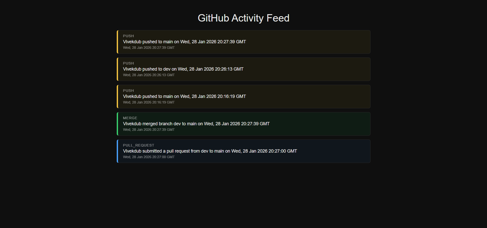

# Webhook Repo

A Flask-based webhook receiver system that captures GitHub events (Push, Pull Request, Merge), stores them in MongoDB, and displays them in a real-time polling UI.

This repository acts as the **backend + UI** part of the system. It receives GitHub webhooks, normalizes the data, stores it in MongoDB, and exposes an API that a frontend polls every 15 seconds to display repository activity.

---

## 📌 Features

* GitHub webhook integration
* Flask backend
* MongoDB storage
* Event normalization
* Real-time polling UI (15s refresh)
* Clean minimal frontend
* Color-coded activity feed

  * 🟡 Push → Yellow
  * 🔵 Pull Request → Blue
  * 🟢 Merge → Green

---

## 🏗️ Architecture

```
GitHub Repo (action-repo)
        ↓
     Webhook
        ↓
Flask API (/webhook)
        ↓
   MongoDB Store
        ↓
Flask API (/events)
        ↓
Frontend (static/index.html)
        ↓
 Polling every 15 seconds
```

---

## 📂 Project Structure

```
webhook-repo/
│
├── app.py
├── requirements.txt
├── .env
│
├── static/
│   └── index.html
│
├── assets/
│   └── ui-preview.png   # frontend screenshot
│
└── README.md
```

---

## ⚙️ Tech Stack

* **Backend:** Flask (Python)
* **Database:** MongoDB
* **Frontend:** HTML + CSS + Vanilla JS
* **Tunneling:** ngrok (for GitHub webhooks)

---

## 🔌 MongoDB Configuration

MongoDB runs locally and connects via:

```
mongodb://localhost:27017
```

Environment variables (`.env`):

```env
MONGO_URI=mongodb://localhost:27017
DB_NAME=github_webhooks
COLLECTION_NAME=events
FLASK_ENV=development
```

---

## 🚀 Setup Instructions

### 1️⃣ Clone Repository

```bash
git clone <repo-url>
cd webhook-repo
```

---

### 2️⃣ Install Dependencies

```bash
pip install -r requirements.txt
```

---

### 3️⃣ Start MongoDB

Ensure MongoDB service is running locally.

---

### 4️⃣ Run Flask Server

```bash
python app.py
```

Server will start at:

```
http://localhost:5000
```

---

## 🔗 GitHub Webhook Setup

1. Create a separate repo: `action-repo`
2. Go to **Settings → Webhooks → Add webhook**
3. Use ngrok to expose local server:

```bash
ngrok http 5000
```

4. Set Payload URL:

```
https://<ngrok-id>.ngrok-free.app/webhook
```

5. Content-Type: `application/json`
6. Events:

   * ✔ Push
   * ✔ Pull Requests

---

## 📡 API Endpoints

### Webhook Receiver

```
POST /webhook
```

Receives GitHub events

---

### Fetch Events

```
GET /events
```

Returns latest events from MongoDB

---

### Health Check

```
GET /health
```

---

## 🖥️ Frontend

The UI is served using Flask static hosting.

Path:

```
/static/index.html
```

Access via browser:

```
http://localhost:5000
```

---

## 🔄 Event Types Supported

### Push

```
{author} pushed to {to_branch} on {timestamp}
```

### Pull Request

```
{author} submitted a pull request from {from_branch} to {to_branch} on {timestamp}
```

### Merge

```
{author} merged branch {from_branch} to {to_branch} on {timestamp}
```

---

## 🧠 Data Schema

```json
{
  "type": "push | pull_request | merge",
  "author": "string",
  "from_branch": "string | null",
  "to_branch": "string",
  "timestamp": "ISODate"
}
```

---

## 🖼️ UI Preview



---

## ✅ Status

* Webhook integration: ✔
* Event parsing: ✔
* MongoDB storage: ✔
* API layer: ✔
* UI polling: ✔
* Real-time feed: ✔

---

## 🎯 Purpose

This project demonstrates:

* Webhook-based system design
* Backend event ingestion
* Data normalization
* Real-time data pipelines
* Database persistence
* API design
* Minimal frontend rendering

Designed as part of an internship assessment task.

---

## 📎 Related Repository

* `action-repo` → GitHub event generator repository

---

## 👤 Author

**Vivek Dubey**

---

> Clean architecture. Minimal design. Real-time pipeline. Production-style structure.
